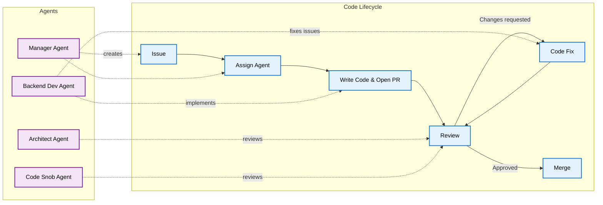

# jm-code

Bot that syncs with GitHub and spawns agents to write code, review pull requests, and fix issues in a loop.

```
Issue -> Assign agent -> Write code -> PR -> Review -> Fix/Re-review loop -> Merge
```

Also detects and fixes CI/CD failures and merge conflicts automatically.


```mermaid
flowchart LR
    subgraph LIFECYCLE["Code Lifecycle"]
        ISSUE["Issue"]
        TRIAGE["Assign Agent"]
        WRITE["Write Code & Open PR"]
        REVIEW["Review"]
        FIX["Code Fix"]
        MERGE["Merge"]
        ISSUE --> TRIAGE --> WRITE --> REVIEW
        REVIEW -->|Changes requested| FIX
        FIX --> REVIEW
        REVIEW -->|Approved| MERGE
    end
    subgraph AGENTS["Agents"]
        MANAGER["Manager Agent"]
        ARCH["Architect Agent"]
        DEV["Backend Dev Agent"]
        SEC["Code Snob Agent"]
    end
    MANAGER -.->|creates| ISSUE
    MANAGER -.-> TRIAGE
    DEV -.->|implements| WRITE
    ARCH -.->|reviews| REVIEW
    SEC -.->|reviews| REVIEW
    DEV -.->|fixes issues| FIX

    classDef lifecycleNode fill:#e3f2fd,stroke:#1976d2,stroke-width:2px,color:#000
    classDef agentNode fill:#f3e5f5,stroke:#7b1fa2,stroke-width:2px,color:#000

    class ISSUE,TRIAGE,WRITE,REVIEW,FIX,MERGE lifecycleNode
    class MANAGER,ARCH,DEV,SEC agentNode
```

## How It Works

1. **Sync** -- Continuously fetches issues and PRs from GitHub via `gh` CLI, computes workflow state, stores in SQLite
2. **Dispatch** -- Based on state, spawns agents via OpenClaw gateway (`sessions_spawn`)
3. **Dev** -- Agent clones repo into a git worktree, reads task file, writes code, opens PR
4. **Review** -- Multiple reviewer agents check out the PR branch and submit reviews
5. **Fix loop** -- If changes requested or CI fails, dev agent is re-spawned to address feedback (max 3 iterations)
6. **Merge** -- Once approval rules are met, the merge agent auto-merges

Agent selection (which dev gets the issue) uses a heuristic based on issue keywords (frontend vs backend), cached per-issue in SQLite.

## Sample Project

https://github.com/miller46/jm-api

#### Sample workflow - https://github.com/miller46/jm-api/pull/93
 * Manager agent creates spec and GitHub issue https://github.com/miller46/jm-api/issues/92
 * Backend-dev agent creates code and pull request (user miller46backenddev)
 * Automated CI status checks pass
 * Architect agent reviews and approves pull request (user miller46architect)
 * Code merged

## Sync States

### Issues

| Status | Action | What happens |
|---|---|---|
| `open` | `needs_dev` | Spawn dev agents (backend-dev, frontend-dev, etc) |
| `in_progress` | `none` | Dev agent already assigned, wait |
| `pr_created` | `none` | PR exists for this issue, tracking moves to PR |
| `closed` | `none` | Done |

### Pull Requests

| Status | Action | What happens |
|---|---|---|
| `pending_review` | `needs_review` | Spawn reviewer agents (architect, code-snob, etc.) |
| `changes_requested` | `needs_fix` | Dev agent addresses review feedback |
| `checks_failing` | `needs_status_fix` | Dev agent fixes CI failures |
| `conflicting` | `needs_conflict_fix` | Dev agent resolves merge conflicts |
| `approved` | `ready_to_merge` | All required reviewers approved, auto-merge |
| `merged` | `none` | Done |
| -- | `max_iterations_reached` | Fix attempts exceeded limit (3), no further action |

## Setup

### Prerequisites

- Go 1.25+
- GitHub CLI (`gh`) installed and authenticated
- OpenClaw gateway running

### Build

```bash
go build -o orchestrator .
```

### Run

```bash
./orchestrator --interval 600 --config ./config --db ~/.openclaw/workspace-manager/workflow.db
```

| Flag | Default | Description |
|---|---|---|
| `--interval` | `600` | Sync interval in seconds |
| `--config` | `./config` | Config directory path |
| `--db` | `~/.openclaw/workspace-manager/workflow.db` | SQLite database path |

### Environment Variables

```bash
OPENCLAW_GATEWAY_URL=http://127.0.0.1:18789   # OpenClaw gateway endpoint
OPENCLAW_GATEWAY_TOKEN=<token>                  # Gateway auth token
```

### OpenClaw Configuration

The bot communicates with agents through the OpenClaw gateway. The gateway must:

- Be running and reachable at `OPENCLAW_GATEWAY_URL`
- Have a valid `OPENCLAW_GATEWAY_TOKEN`
- **Allow the tools `sessions_spawn` and `sessions_send`** -- these are the two OpenClaw tools used to create agent sessions and send messages to them

### Git & GitHub Identity Per Agent

Each agent acts as a separate GitHub user. This requires two things per agent:

**1. GitHub token** in `~/.openclaw/agents/{agent_name}/agent/hosts.yml`

This is the `gh` CLI config directory. The `hosts.yml` file contains the agent's GitHub OAuth token and username. Used by `submit_pr`, `submit_pr_review`, and `git_commit` tools to authenticate as the correct GitHub user.

Example structure:
```
~/.openclaw/agents/
  backend-dev/agent/hosts.yml
  frontend-dev/agent/hosts.yml
  architect/agent/hosts.yml
  code-snob/agent/hosts.yml
```

**2. Local git identity** in `.gitconfig`

Each agent needs a git name and email configured so commits are attributed correctly.

### Workspace Layout

```
~/.openclaw/
  workspace-manager/
    workflow.db           # SQLite state (issues, PRs, dispatch records, agent selections)
  workspace-{agent-id}/
    {owner}--{repo}.git/  # Bare repo cache (shared across issues)
    {owner}--{repo}/      # Git worktree (checked out for current task)
    tasks/                # Task files written before agent spawn
  agents/
    {agent-name}/agent/   # gh CLI config dir per agent (hosts.yml)
```

## Config

| File | Purpose |
|---|---|
| `config/repos.json` | Which repos to manage, limits, default agent |
| `config/agents.json` | Available dev agents |
| `config/reviewers.json` | Reviewer agents and approval rules |
| `config/workflow.json` | Merge agent config |

Per-repo overrides go in `config/{owner}/{repo}/` (e.g. `config/miller46/jm-api/reviewers.json`). Overrides **replace** the default entirely -- they do not merge.

### Approval Rules

Configured in `reviewers.json` under `approval_rules`:

```json
{
  "mode": "majority",
  "min_approvals": 2,
  "required_reviewers": [],
  "veto_powers": []
}
```

## Project Structure

```
cmd/
  root.go                    # CLI entry point (Cobra), flags, graceful shutdown
internal/
  bot/bot.go                 # Main sync-dispatch loop
  config/config.go           # JSON config loaders with per-repo overrides
  db/
    db.go                    # SQLite store (WAL mode)
    models.go                # WorkflowItem, dispatch events, agent selections
  github/
    sync.go                  # State machine (GitHub state -> workflow state -> action)
    types.go                 # Type definitions
    merge.go                 # PR merge logic
  agent/
    agent.go                 # Agent interface
    dev.go                   # Dev agent prompt templates
    review.go                # Reviewer prompt templates
    spawn.go                 # OpenClaw gateway HTTP client, agent selection heuristic
    workspace.go             # Bare clone, worktree, task file management
  workflow/tasks.go          # Dispatches agents based on workflow actions
  tools/
    tool.go                  # Tool interface
    git_commit.go            # Commit, rebase, push
    submit_pr.go             # Create PR via gh CLI
    submit_review.go         # Submit PR review via gh CLI
    shell_tool.go            # Bash execution tool
    issues.go                # Issue queue API (DB queries)
    prs.go                   # PR queue API (DB queries)
main.go                      # Entry point
```

## Gotchas

- **Fix iterations are capped at 3.** After 3 fix attempts, the action becomes `max_iterations_reached` and no further agents are dispatched.

- **Per-repo config overrides replace entirely.** If you add `config/owner/repo/reviewers.json`, it replaces the default reviewer list -- it does not merge with the global config.

- **Reviewers are deduplicated by HEAD SHA.** Reviewers are only dispatched once per unique commit SHA to avoid re-reviewing the same code. A new push triggers fresh reviews.

- **SHA-based re-review.** If code changes after approval, the PR is moved back to `pending_review` for a fresh round of reviews.

- **Workspace setup must succeed before agent spawn.** Agents are told to read a task file at a specific path. If workspace setup fails silently, the agent will try to read a file that doesn't exist.
