# jm-code

Bot that syncs with GitHub and spawns agents to write code, review pull requests, and fix issues in a loop.


```
Issue → Write code → Pull request → Review → Fix/Re-review loop → Merge
```

Detects and fixes automated CI/CD issues as well (configured inside destination repo)

```mermaid
flowchart LR
    subgraph LIFECYCLE["📋 Code Lifecycle"]
        ISSUE["📝 Issue"]
        TRIAGE["🎯 Assign Agent"]
        WRITE["💻 Write Code & Open PR"]
        REVIEW["👀 Review"]
        FIX["🔧 Code Fix"]
        MERGE["✅ Merge"]
        ISSUE --> TRIAGE --> WRITE --> REVIEW
        REVIEW -->|Changes requested| FIX
        FIX --> REVIEW
        REVIEW -->|Approved| MERGE
    end
    subgraph AGENTS["🤖 Agents"]
        MANAGER["👔 Manager Agent"]
        ARCH["🏗️ Architect Agent"]
        DEV["⚡ Backend Dev Agent"]
        SEC["🔒 Security Reviewer Agent"]
    end
    MANAGER -.->|creates| ISSUE
    MANAGER -.-> TRIAGE
    DEV -.->|implements| WRITE
    ARCH -.->|reviews| REVIEW
    SEC -.->|reviews| REVIEW
    DEV -.->|fixes issues| FIX
    
    classDef lifecycleNode fill:#e3f2fd,stroke:#1976d2,stroke-width:2px,color:#000
    classDef agentNode fill:#f3e5f5,stroke:#7b1fa2,stroke-width:2px,color:#000
    
    class ISSUE,TRIAGE,WRITE,REVIEW,FIX,MERGE lifecycleNode
    class MANAGER,ARCH,DEV,SEC agentNode
```




## Projects Built By Agents Using `jm-code`

* https://github.com/miller46/agent-command-center
* https://github.com/miller46/jm-api


## Sync States

### Issues

| Status | Action | What happens                                      |
|---|---|---------------------------------------------------|
| `open` | `needs_dev` | Spawn dev agents (backend-dev, frontend-dev, etc) |
| `in_progress` | `none` | Dev agent already assigned, wait                  |
| `pr_created` | `none` | PR exists for this issue, tracking moves to PR    |
| `closed` | `none` | Done                                              |

### Pull Requests

| Status | Action | What happens |
|---|---|---|
| `pending_review` | `needs_review` | Spawn reviewer agents (architect, code-snob, etc.) |
| `changes_requested` | `needs_fix` | Dev agent addresses review feedback |
| `checks_failing` | `needs_status_fix` | Dev agent fixes CI failures |
| `approved` | `ready_to_merge` | All required reviewers approved, auto-merge |
| `merged` | `none` | Done |


## Key Files

| File                    | Purpose                                                |
|-------------------------|--------------------------------------------------------|
| `bot.py`                | Entry point. Main app logic                            |
| `github/github_sync.py` | State machine (GitHub state → workflow state → action) |
| `workflow/tasks.py`     | Dispatches agents based on actions                     |
| `agent/dev_agent.py`    | Spawns agents for dev, fixes, conflict resolution      |
| `agent/review_agent.py` | Spawns agents for reviews                              |
| `tools/`                | Custom tools for agents                                |

## Config

| File                    | Purpose                            |
|-------------------------|------------------------------------|
| `config/repos.json`     | Which repos to manage and sync     |
| `config/reviewers.json` | Reviewer agents and approval rules |
| `config/workflow.json`  | Agent routing and merge criteria   |
| `config/agents.json`    | Dev agents                         |

Per-repo overrides go in `repos/{owner}/{repo}/config/`.
